# Network

## 1.1.1 Основы клиент-серверной архитектуры
Всё это работает в формате «запрос-ответ». Клиент, следуя API, контракту, делает запрос на сервер, в свою очередь, сервер, следуя API, отвечает на клиентский запрос. Например:
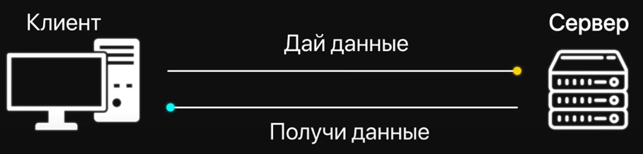

В качестве клиента могут выступать не только браузеры, но и мобильные приложения и даже другие серверы. Следовательно, сервер – поставщик данных/услуг, клиент – потребитель данных/услуг.
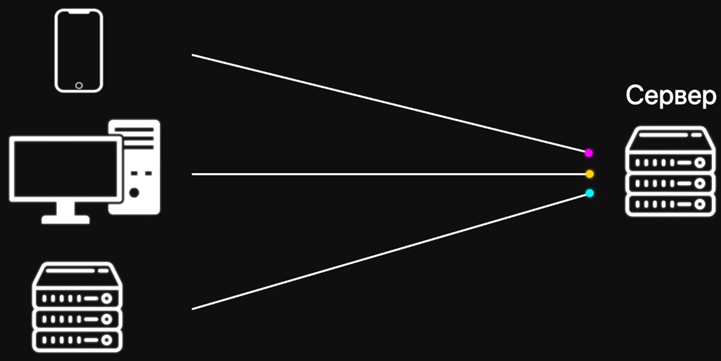

## 1.1.2 Основа WEB
Взаимодействие частей распределенного в сети приложения осуществляется через протоколы прикладного уровня. 
Вот некоторые протоколы прикладного уровня:
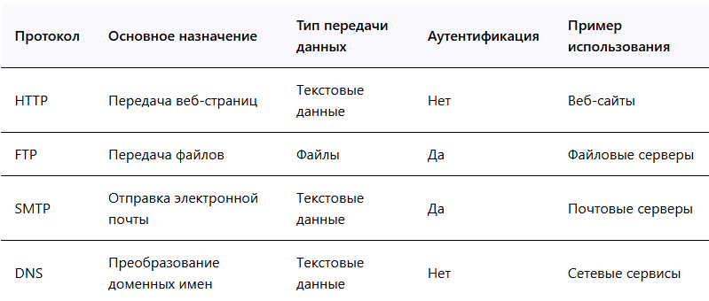

### 1.1.2.1 HTTP
**Основные версии HTTP**
1. HTTP/0.9 (1991)
2. HTTP/1.0 (1996)
3. HTTP/1.1 (1997)
4. HTTP/2 (2015)
5. HTTP/3 (с 2022 на стадии предлагаемого стандарта)

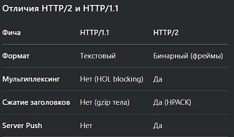

---

**Структура HTTP-сообщений**

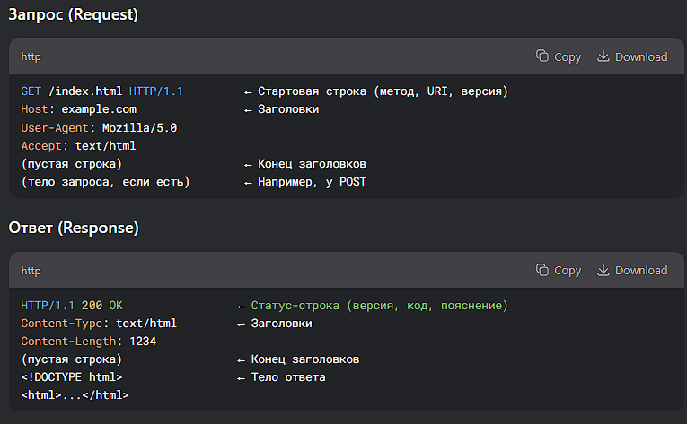

---

**HTTPS**

Обязательный стандарт и предоставляет следующие гарантии касаемо передаваемых данных через HTTP:
- Конфиденциальность (можно как и прежде перехватывать пакеты, однако передаваемые данные будут зашифрованы)
- Аутентичность (проверка сертификата сервера)
- Целостность (защита от подмены данных)

Это осуществляется за счет работы поверх протоколов защиты транспортного уровня (SSL/TLS)

Основные этапы работы:
1. TCP-соединение (клиент подключается к серверу на порт 443).
2. TLS-рукопожатие (аутентификация + обмен ключами).
3. Шифрованный обмен данными (HTTP-запросы/ответы в зашифрованном виде).

---

**Cookies**
Cookies — это механизм, позволяющий серверу хранить небольшие фрагменты данных на стороне клиента (в браузере). Могут использоваться для:
- Аутентификации (сессии, токены)
- Персонализации (настройки пользователя)
- Трекинга (аналитика, реклама)

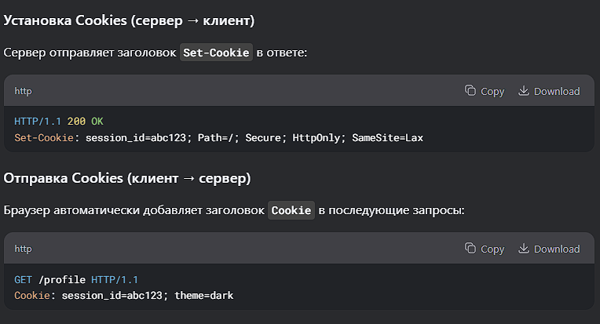

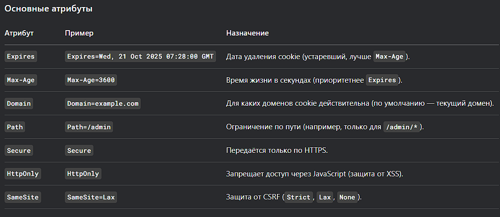

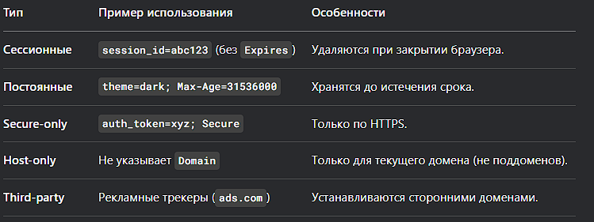

ссылка на чат по теме: https://chat.deepseek.com/a/chat/s/9c6069ba-5b41-44f7-9914-67811e02bfa8

### 1.1.2.2 DNS
Преобразует удобочитаемые для человека записи в сетевые адреса.

**Ключевые характеристики**
- децентрализованная система
- иерархия доменов
- кэширование
- работает поверх TCP и UDP

## 1.1.3 Протоколы защиты транспортного уровня
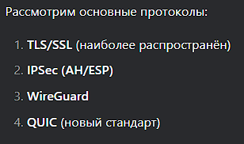

**TLS/SSL**
- Защита передаваемых данных по протоколам прикладного уровня (HTTP(S), SMTP(S), FTP(S))
- Работает поверх TCP (443 порт для HTTPS)

**IPSec**
- Защита IP-пакетов
- Используется в VPN (например, корпоративные сети)

**WireGuard**
- Современный легкий VPN-протокол (альтернатива IPSec)
- Работает поверх UDP на порту 51820

**QUIC**
- Экспериментальный транспортный протокол от Google со встроенным TLS
- Работает поверх UDP (443 порт)

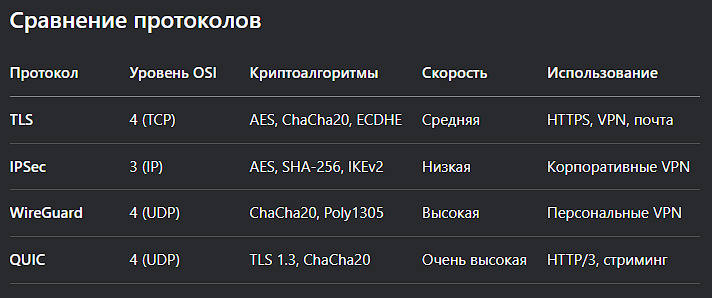

## 1.1.4 Передача данных
**Идемпотентность запросов** - это свойство, которое означает, что повторный идентичный запрос, сделанный один или несколько раз подряд, имеет один и тот же эффект, не изменяющий состояние сервера. Корректно реализованные методы GET, PUT, DELETE идемпотенты, но не метод POST. Например, несколько одинаковых, подряд идущих PUT-запросов всегда дадут одинаковый результат, поскольку каждый последующий запрос перезапишет результаты предыдущего. Чего нельзя сказать о методе POST в контексте создания каких-то ресурсов, скажем, регистрация аккаунта. Несколько одинаковых запросов с методом POST и данными для регистрации аккаунта – зарегистрируют аккаунты, создав дубли ресурсов.
### 1.1.4.1 REST и SOAP. Сравнение
**REST API** – архитектурный стиль, который содержит в себе описание наиболее прозрачного и эффективного взаимодействия клиента с сервером поверх HTTP.
Концепции REST API:
- Модель взаимодействия -- клиент-сервер в формате JSON/XML.
- Многослойность системы - клиент может ничего не знать про устройство сервера и просто пользоваться API.
- Stateless. Каждый новый запрос от клиента к серверу как в первый раз. 
- Единообразный унифицированный - семантически правильный вызов методов и статус кодов, названия эндпоинтов во мн. числе, одинаковые заголовки называются одинаково
- Кэширование средствами HTTP, или средствами на серверной части (Redis)
- Версионирование - внесение правок в API должно обратно совместимым. Иначе создается отдельная версия API с новым функционалом.
- Документирование - swagger, postman.

**SOAP** - это протокол обмена структурированными сообщениями в формате XML/Soap-XML.
Здесь нет эндпоинтов как в REST, но здесь есть операции. Например, операция «getBook», где в поле «input» пишется то, что ожидается на входе и «output» - то что будет отдано на выходе.

### 1.1.4.2 Websocket
WebSocket — это протокол для полнодуплексной (двусторонней) связи между клиентом и сервером поверх одного TCP-соединения. Он позволяет серверу отправлять данные клиенту без ожидания запроса, что делает его идеальным для:
- Чат-приложений
- Онлайн-игр
- Реал-тайм уведомлений (например, биржевые котировки)
- Стриминга данных

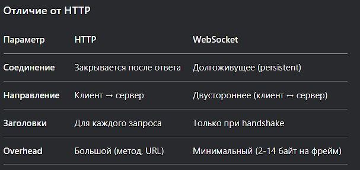

### 1.1.4.3 SSE
Server-Sent Events (SSE) — это технология, позволяющая серверу отправлять данные клиенту в реальном времени через обычное HTTP-соединение. В отличие от WebSocket, SSE:

- Работает только в одном направлении (сервер → клиент).
- Использует текстовый формат (обычно JSON или plain text).
- Поддерживается нативно в браузерах через EventSource.

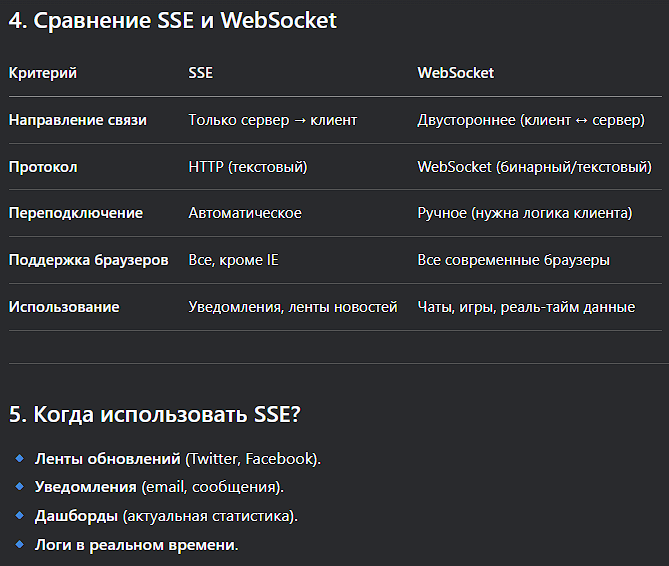

### 1.1.4.4 HTTP Long Polling
HTTP Long Polling — это техника, имитирующая реальное время за счёт "долгих" HTTP-запросов. Сервер не отвечает клиенту мгновенно, а держит соединение открытым до появления новых данных или таймаута.

**Основные этапы**
1. Клиент отправляет запрос на сервер.
2. Сервер "замораживает" ответ, пока не появится новое событие (или не истечёт таймаут).
3. При новых данных сервер отвечает, и клиент тут же отправляет новый запрос.
4. Если соединение разрывается, клиент переподключается.

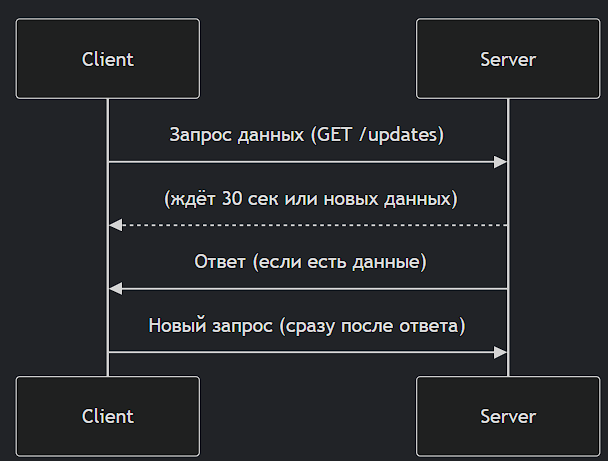

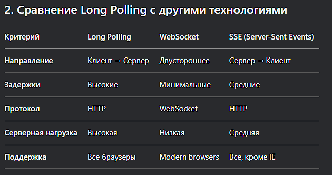

### 1.1.4.5 WebRTC
WebRTC — это открытая технология, позволяющая устанавливать прямое peer-to-peer (P2P) соединение между браузерами для передачи аудио, видео и данных в реальном времени без промежуточных серверов (или с минимальным их участием).

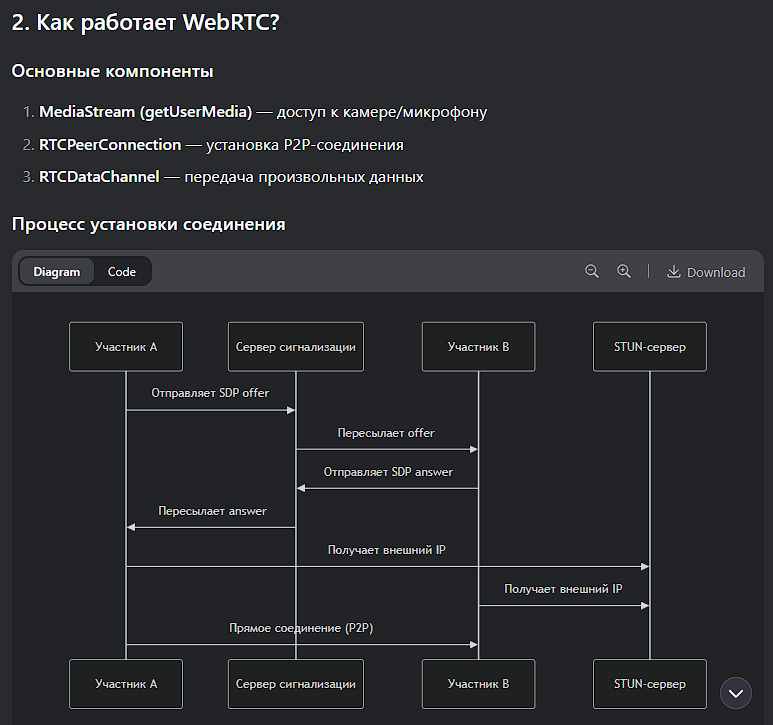

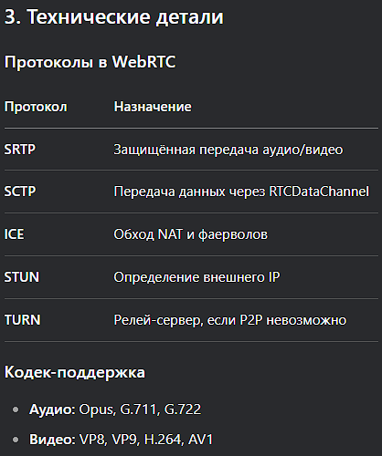

### 1.1.4.6 GraphQL
GraphQL — альтернатива REST API. Это язык запросов для API и среда выполнения для их обработки, разработанная Facebook в 2012 году. Главная особенность — клиент точно определяет, какие данные ему нужны.

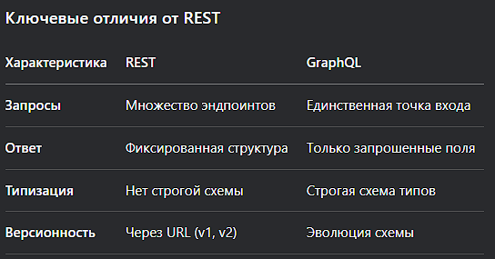

Когда выбирать GraphQL?
- 🌐 Сложные SPA-приложения
- 📱 Мобильные приложения с ограниченным трафиком
- 🔗 Микросервисная архитектура (API Gateway)
- 🛒 Электронная коммерция с разнообразными клиентами

### 1.1.4.7 RPC (gRPC, tRPC)
RPC (Remote Procedure Call) — это протокол для вызова функций на удалённом сервере, как если бы они были локальными. Современные реализации:

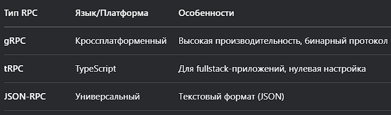

**gRPC**: высокопроизводительный RPC от Google
Особенности
- 🚀 Протокол на основе HTTP/2 (мультиплексирование, бинарный формат)
- 📐 Использует Protocol Buffers (protobuf) для сериализации
- 🔄 Поддержка 4 типов вызовов:
  - Унарный (запрос-ответ)
  - Серверный стриминг
  - Клиентский стриминг
  - Двунаправленный стриминг

**tRPC**: RPC для TypeScript-разработчиков
Особенности:
* 🧩 Нулевая настройка для TypeScript-проектов
* 🔄 Автоматический вывод типов на клиенте и сервере
* ⚡ Работает поверх HTTP (не требует HTTP/2)

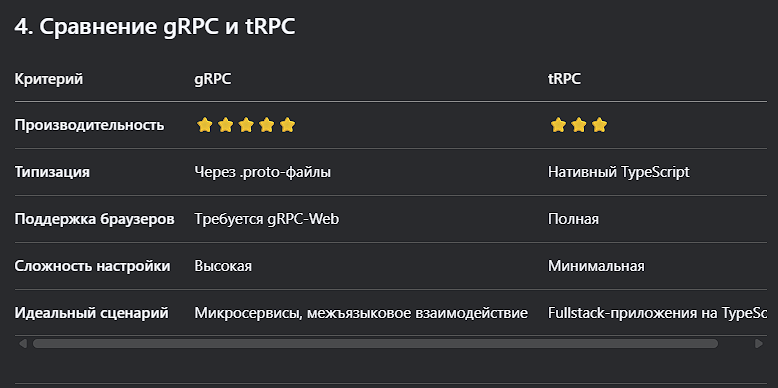

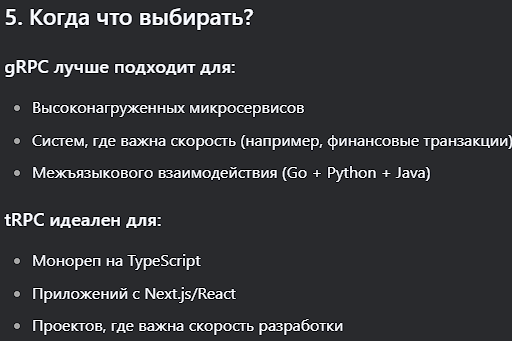