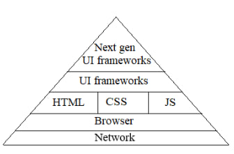

# WIKI-frontend
Цель данного проекта - хранение, расширение и структурирование знаний во frontend разработке

## 1. Pyramid frontend (нисходящий подход)

### 1.1 [Network](pyramid/network/network.md)
#### 1.1.1 Основы клиент-серверной архитектуры
#### 1.1.2 Основа WEB
##### 1.1.2.1 HTTP
##### 1.1.2.2 DNS
#### 1.1.3 Протоколы защиты транспортного уровня
#### 1.1.4 Передача данных
##### 1.1.4.1 REST и SOAP. Сравнение
##### 1.1.4.2 Websocket
##### 1.1.4.3 SSE
##### 1.1.4.4 HTTP Long Pooling
##### 1.1.4.5 WebRTC
##### 1.1.4.6 GraphQL
##### 1.1.4.7 RPC (gRPC, tRPC)

### 1.2 [Browser](pyramid/browser/browser.md)
#### 1.2.1 Структурная схема
##### 1.2.1.1 Пользовательский интерфейс
##### 1.2.1.1 Ядро браузера
#### 1.2.2 Браузерный Event Loop; основы концепции однопоточного и многопоточного программирования; асинхронная модель
#### 1.2.3 Стадии рендера (DOM, CSSOM, Render tree, style calculation, layout, paint, composite)
#### 1.2.4 API
##### 1.2.4.1 DOM
##### 1.2.4.2 Local storage
##### 1.2.4.3 Session storage
##### 1.2.4.4 Browser cache
##### 1.2.4.5 Cookie

### 1.3 JavaScript и TypeScript, HTML, CSS

### 1.4 UI frameworks
#### 1.4.1 React
#### 1.4.2 Angular

### 1.5 next gen ui frameworks
#### 1.5.1 Введение
#### 1.5.2 Next.js

---

## 2. Инфраструктура
### 2.1 git 
### 2.2 CI/CD 
### 2.3 Мониторинг 
### 2.4 Тестирование 
### 2.5 Docker
### 2.6 Kubernetes

---

## 3. Связанные технологии
### 3.1 PWA
### 3.2 Web assembly
### 3.3 Virtual DOM

--- 

## 4. Безопасность
### 4.1 Цифровые сертификаты (SSL, TLS)

---

## 5. Производительность и оптимизация
### 5.1 оптимизация ассетов
### 5.2 инструменты оптимизации графики/видео
### 5.2 использование SVG для плоской графики
### 5.2 актуальные форматы веб-шрифтов

---

## 6. Инструменты
### 6.1 Сборщики
### 6.2 Линтеры
### 6.3 lint-stage
### 6.4 ng & nx

---

## 7. Приложение
### 7.1 Асимптотическая сложность
### 7.2 Алгоритмы