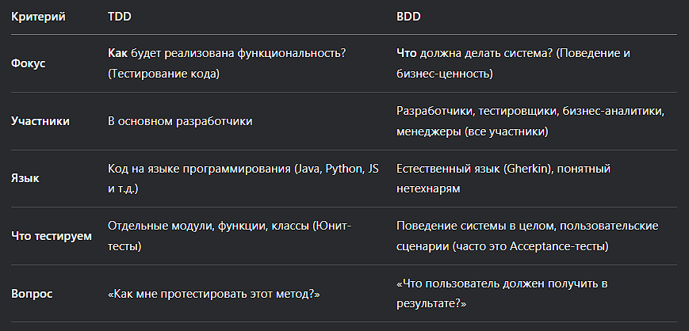

# 7. Тестирование
**Плюсы и минусы автоматизированного тестирования**
Плюсы (+)
* Скорость и эффективность. Автотесты выполняются в разы быстрее ручного тестирования, особенно на больших проектах и при частых запусках.
* Масштабируемость. Можно легко запустить тысячи тестов за раз, что практически нереализуемо вручную.
* Раннее обнаружение ошибок. Позволяет находить баги сразу после их появления, что значительно дешевле и проще их исправлять.
* Высокая точность. Исключается человеческий фактор: тесты не устают и не ошибаются по невнимательности.
* Непрерывная интеграция (CI/CD). Автотесты — это основа современных практик разработки, позволяющих автоматически проверять каждое изменение в коде.
* Повторяемость. Тесты всегда выполняют одни и те же шаги одинаково, что критично для проверки сложных сценариев.
* Документирование. Хорошие тесты служат примером использования кода и показывают, как система должна себя вести.

Минусы (–)
* Высокие первоначальные затраты. Написание хороших автотестов требует времени и квалификации разработчиков/инженеров по тестированию.
* Сложность поддержки. Если код приложения часто меняется, тесты нужно постоянно обновлять, иначе они устаревают и начинают "ломаться" (false fails).
* Ограниченность. Автотесты плохо справляются с проверкой юзабилити, визуального оформления или сложных пользовательских сценариев, где нужны человеческое восприятие и креативность.
* Ложное чувство безопасности. Прохождение всех тестов не гарантирует 100% отсутствия багов. Тесты проверяют только то, что в них заложено программистом. Они могут не охватывать все возможные edge-кейсы.
* Не заменяет ручное тестирование. Является мощным дополнением, но не полной заменой. Исследовательское и usability-тестирование лучше проводить вручную.

---

**Концепции TDD и BDD**

TDD (Test-Driven Development) — Разработка через тестирование. Это техника разработки, при которой сначала пишется тест, а затем код, который этот тест удовлетворяет.

BDD (Behavior-Driven Development) — Разработка через поведение. Это эволюция и надмножество TDD, которое фокусируется не на тестировании функций, а на поведении системы с точки зрения конечного пользователя и бизнеса.

**Отличие smoke-тестирования от регрессионного**

**smoke-тестирование**

Это поверхностное, быстрое тестирование основной функциональности приложения после сборки (новой или после изменений).

_Цель_: Проверить, что ключевые функции работают хотя бы на базовом уровне, и сборка стабильна для более глубокого тестирования. Если smoke-тесты не проходят, то можно остановить CI pipeline и не приступать к регрессионному тестированию.

**Регрессионное тестирование**

Это полное и глубокое тестирование уже проверенной ранее функциональности.

_Цель_: Убедиться, что новые изменения (фичи, исправления багов) не сломали существующий, рабочий код. То есть не появились регрессионные баги.

---

**Способы мокирования**

Мокирование (Mocking) — это техника создания объектов-заглушек, которые заменяют реальные зависимости тестируемого модуля, чтобы изолировать его и сделать тесты предсказуемыми, быстрыми и независимыми от внешней среды.

* Моки (Mocks) - проверка факта вызова метода.
* Стабы (Stubs) - проверка возвращаемых значений тестируемой функциональности.
* Фикстуры (Fixtures) - подготовка среды для выполнения тестов и завершения тестов.